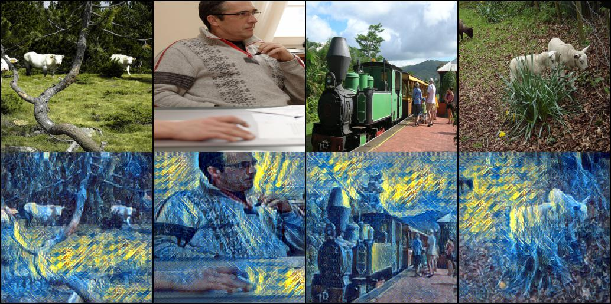

# Fast-Neural-Style-Transfer
```sh
Implementation of Perceptual Losses for Real-Time Style Transfer and Super-Resolution.
```

# Introduction in Chinese
prepare

# Environment
```sh
OS: Ubuntu16.04
Graphics card: Titan xp
cuda version: 10.0.130
cudnn version: 7.0.4
python 3.5+(have installed the neccessary dependencies):
	--pytorch==0.4.1
	--torchvision==0.2.2
	--numpy
	--pyav
	--tqdm
	--pillow
	--argparse
	--sk-video
```

# Usage
## Train
#### Step1
```
Modify the cfg.py according to your need:
'''dataset'''
datasetpath = 'dataset/images' # use coco(http://cocodataset.org/#home) in original paper
					'''
					datasetpath example:
						-images
							--folders1
							--folders2
							...
							--foldersn
					'''
style_image_path = 'dataset/styles/candy.jpg' # the target style image path


'''train'''
num_epochs = 5 # training epochs
batch_size = 4 # batch size
image_size = (256, 256) # input image size
learning_rate = 1e-3 # learning rate
mean = [0.485, 0.456, 0.406] # used for pytorch pretrained models
std = [0.229, 0.224, 0.225] # used for pytorch pretrained models
backupdir = 'backup' # backup folder
save_interval = 500 # every save_interval batchs, save the model
logfilepath = 'train.log' # file to save the train log
checkpointpath_restore = '' # used to restore model
style_loss_weight = 1e5 # used to balance the style loss and content loss
content_loss_weight = 2e-6 # used to balance the style loss and content loss
```
#### Step2
```sh
Run "python train.py"
```
## Test
```
Run "python test.py --datapath <imagepath/videopath> --checkpointpath <checkpointpath> --outputpath <outputpath>"
```

# Effect
#### Picture

#### Video


# References
```sh
[1]. https://github.com/jcjohnson/fast-neural-style
[2]. Perceptual Losses for Real-Time Style Transfer and Super-Resolution(Johnson, Justin and Alahi, Alexandre and Fei-Fei, Li)
```

# More
#### WeChat Official Accounts
*Charles_pikachu*  
